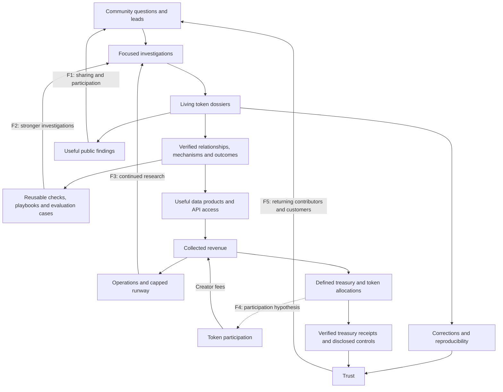

<!-- SPDX-License-Identifier: Apache-2.0 -->
# RealOrRug: vision

**Updated:** 2026-09-30. **Status:** accepted product direction, recorded from
Josh's instructions; proposed economics and future ideas are labelled below.

This is the source of truth for what we are building and why. [ROADMAP.md](ROADMAP.md)
derives delivery order and acceptance criteria from it. [AGENTS.md](AGENTS.md)
governs engineering and evidence standards. [ADR 0043](docs/adr/0043-the-public-library-and-compounding-intelligence.md)
records this direction and its precise amendments to earlier decisions. Code,
captures and receipts establish what actually works; this document does not
turn an intended feature into an implemented one.

## 1. The product

**Launch coverage, accepted 2026-10-01:** the investigator supports Solana,
Base and Ethereum before joint launch, with comparable fee, control, liquidity
and historical-transfer coverage within explicitly supported protocols. New
EVM requests specify their network. [ADR 0044](docs/adr/0044-three-chain-investigations-and-shared-cases.md)
records this expansion; the token still launches on Solana/pump.fun with SOL.

RealOrRug is a public forensic investigator for tokens. A person can ask a
specific question, supply a wallet or transaction lead, and receive an
informed assessment grounded in checkable evidence. Other people can build on
the same investigation. **Real or rug? It shows the facts. You decide.**

The product combines an X investigator, a public website and a living case
library. The agent investigates claims rather than merely writing a generic
token summary. For example, "95% of fees are going somewhere undisclosed"
requires checking which fees, over which period, against which denominator,
through which accounts and contracts, and with what legitimate alternatives.
The percentage begins as a submitted claim, not an established fact.

The durable asset is the intelligence accumulated across these investigations:
historical observations, verified relationships, mechanisms, outcomes,
corrections and useful investigation methods. The community token helps fund
and identify the project. Its price is not a measure of investigative quality.

The investigator and token launch together with a free public Library. Paid
investigations come later. Holding tokens, paying for work, sponsorship and
community popularity never determine a verdict. The project's own token is
investigated by the same standards. The existing X profile picture and banner
remain the brand foundation.

## 2. Five connected flywheels

A flywheel must leave something useful that improves the next cycle. Each
arrow is a hypothesis to measure, not a promise of automatic growth. More
requests can also create noise, expenses and queues. Allocation is a financial
mechanism; its effect on sustained participation needs evidence.

| ID and name | How it works | Dependencies and failure points | Measurements | Current position |
|---|---|---|---|---|
| **F1: Attention and Participation** | Useful public investigations are shared, attracting questions and relevant leads that produce further investigations. | Clear answers, shareable case links and a useful follow-up path. Spam, sensational unsupported claims and poor responses can consume attention without creating value. | Returning contributors; useful leads per case; requests producing verified additions; time to useful response. | Mention/reply infrastructure exists; claim-specific investigation and durable collaboration need completion. |
| **F2: Compounding Intelligence** | Investigations enrich living dossiers; verified relationships, patterns and outcomes improve retrieval, checks and subsequent investigations. | Provenance, corrections, freshness and actual reuse by the agent. Duplicate allegations, mistaken attribution, sampling bias and unused archives weaken the loop. | Evidence reused; new useful relationships; unresolved questions resolved; false positives corrected; quality and cost on comparable evaluation cases. | Read memory, dossier checks and research storage provide foundations; the public case-to-next-investigation loop is not connected end to end. |
| **F3: Sustainable Funding** | Useful investigations create paid data/API demand and may attract token participation; collected revenue funds continued service and research. | Genuine demand, affordable fulfillment, controlled costs and spendable runway. Trading fees fluctuate; purchases that cost more to fulfill than they earn drain the service. | Net service margin; revenue by source; operating coverage; runway; cost per fulfilled investigation. | Creator-fee readers, spend limits and a paid facts endpoint exist; production payment interoperability and recovery remain unverified. |
| **F4: Token Participation** | Disclosed participation produces creator fees; verifiable allocations support operations and, if adopted, burns or permanent liquidity; credible execution may encourage continuing participation. | Actual receipts, executable rules, useful product and trading depth. Buybacks cannot guarantee demand or price; excessive allocation can starve operations. | Allocation compliance; executed burns; quote-asset depth and slippage; disclosed holdings; dependence on trading fees. | Token is unlaunched. Treasury defaults to operator-managed operations/reserve; buy-and-burn and liquidity allocations are proposals. |
| **F5: Trust** | Reproducible findings, visible corrections, disclosed powers and financial receipts encourage people to return, contribute and use the service. | Accessible evidence, honest uncertainty and enforceable controls where promised. A ledger alone cannot prevent misuse; a hash chain alone cannot establish independent custody or prevent operator rewriting. | Reproducibility; correction handling; verified receipts; unexplained reconciliation gaps; returning users and customers. | Evidence checks, journals and launch/treasury readers exist; unified public case and financial ledgers need completion. |

Development should identify which connection a feature strengthens and how
we will check that it did. F2 is the central accumulating asset. F1 brings
leads; F3 sustains the work; F4 connects a community token to disclosed
economic behavior; F5 earns continued participation.

## 3. The agent and its memory

The agent preserves the question and identifies the claim, token, relevant
wallets, transactions and time window. It selects bounded read tools, checks
alternatives, follows productive leads and stops when it has a useful answer
or an explicit coverage gap. A capable model directs research and explains
evidence; deterministic tools establish chain facts and enforce budgets.
Model choice is measured against representative cases and actual costs.

Every finding separates observations, inference and unresolved questions.
Numbers retain their role, denominator, chain and observation time. Missing
data does not mean zero or safety. Transaction links do not by themselves
establish common ownership. Model-written text cannot introduce unsupported
facts or accuse a named person of criminal conduct. Submitted content is
untrusted data, including instructions embedded in metadata or evidence.

The Library and agent use the same underlying case records:

| Accumulating asset | What it contributes |
|---|---|
| Token dossiers | A stable identity for each chain and token address, with questions, findings, evidence, gaps, contributions and revisions. |
| Historical observations | Dated changes in fee destinations, authorities, distribution, liquidity and other measured state. A past observation remains about its original moment. |
| Relationships | Evidence-supported funding, transfer and contract relationships, including infrastructure exclusions and alternative explanations. |
| Mechanisms and patterns | Descriptions of suspicious mechanics and legitimate lookalikes, supporting cases, prerequisites, falsifying evidence and checks that can distinguish them. |
| Outcomes | Later observations that evaluate earlier findings, with outcome definitions, coverage and unresolved cases preserved. |
| Playbooks and evaluation cases | Useful tool sequences, costs, failed approaches, corrections and regression cases that improve subsequent investigations. |

The current assessment can change as evidence arrives. Preserve prior
observations and assessment history; append corrections and show the latest
view. Correcting evidence also revisits dependent findings and statistics.
Community contributions enter as leads and become verified findings only
after checking. Include ordinary tokens, dismissed allegations and unresolved
cases. User-selected investigations cannot establish a market-wide scam rate.

Compounding is demonstrated when the next investigation retrieves relevant
cases and makes better checks. Growing storage alone is insufficient. Begin
with compact records, indexed relationships and targeted retrieval on the
existing SQLite foundation. Keep storage and raw-data retention bounded;
preserve a compact case identity, provenance and revision history for every
analysed token, and disclose when underlying evidence is unavailable.
Fine-tuning and full-chain indexing are future possibilities, not prerequisites.

## 4. Website and public Library

The website makes the investigator useful beyond an X post. Its main surfaces
are the Library, token dossiers, investigation threads, methodology, the
financial ledger and token/control disclosures. Use the current React,
Rust/Axum and SQLite foundation. Add infrastructure only when measured demand
or a demonstrated limitation justifies it.

The **Library** is a free token browser and agent memory surface. Search by
chain and address, with names and tickers as conveniences rather than identity.
Show latest assessment, questions investigated, observation time, coverage,
depth, unresolved checks and revision history. A saved assessment is not a
fresh read; a lightly investigated token is not certified safe. Links let
people share a particular investigation and continue it with useful leads.

The **token dossier** explains what was checked, what supports each finding,
alternative explanations, missing data and what would change the assessment.
X threads and website contributions attach to the same case. Keep contributor
claims visibly distinct from verified findings. Publish meaningful corrections.
Maintain common evidence standards across all entry points.

The **methodology** explains coverage, signal definitions, uncertainty and
limitations. Forecasts and contribution reputation may enrich the product
later; their existing work is preserved but they are outside the critical
launch path. Popularity ranks research priorities, not truth.

### Later: paid work that enriches a public asset

People and agents can pay for fresh data or additional investigative work.
Completed findings enrich the public Library; the purchaser receives the
requested work, machine-readable access where offered and a durable result.
Price buys scope, freshness, tool effort or throughput. It does not buy a
favorable finding or promise certainty. Free public browsing remains available.
Payer identity and purchase amount are not public badges by default.

The future portal flow is: select a token and question; inspect existing
coverage; choose an available scope and explicit price; authorize payment;
see accepted/queued/running status; then inspect the completed dossier and
its additions. Show progress immediately, findings when they are ready.
Start with one bounded paid option after launch. Additional light, focused
and deep options are concepts pending measured costs and useful differences
in scope. Never invent production prices for them in documentation.

x402 is the payment mechanism, not the investigation engine. The existing
facts-only endpoint uses Base USDC in its implementation. Solana USDC is a
candidate for the future portal; its facilitator and wallet flow must be
verified. Native SOL payment or conversion is not promised. Payment chain and
analysed token chain are independent. Keep custody with the user's wallet;
the analyst and model receive no spending key.

Before selling work, prove capacity admission, cost bounds, durable results,
duplicate-charge prevention, settlement reconciliation and recovery after an
interrupted response. Explain incomplete coverage and failed fulfillment;
resolve any charged failure through a tested recovery or refund process.
No result retrieval should require paying a second time for the same purchase.

Bulk purchases may eventually fund broad public coverage. A batch names a
defined token list, chains, scope and time range, with a manifest of completed,
failed and unresolved work. Report cost, coverage and freshness; do not
describe a large batch as "every token in history" without a defined universe
and evidence of completeness. Repeated identical reads need not create new
intelligence. Prioritize useful new observations and changes.

## 5. Launch platform

**Selected: pump.fun on Solana, paired with SOL.** Existing launch, dossier,
graduation and treasury readers reduce integration work for a solo builder.
The token and investigator share the launch ecosystem without requiring a new
agent runtime or financial execution system. This is a practical selection,
not a claim that Solana or pump.fun eliminates trust dependencies.

Comparison below is documentation-based research checked 2026-09-30, not a
capture proving any particular launch or contract configuration.

| Platform | Useful strengths | Costs and control tradeoffs | Decision |
|---|---|---|---|
| **Solana / pump.fun** | Best existing reader fit; curve-to-PumpSwap path; creator-fee infrastructure. Documented V2 fee sharing supports final shares with its configuration admin revoked and permissionless distribution. | Final shares are not an automatic buyback executor. A shared configuration changes fee routing and must be supported by our readers. Platform/program powers and current fee schedules remain dependencies. | Selected; verify actual launch and fee configuration before signing. |
| **Base / Flaunch** | Native fee-funded Progressive Bid Wall and creator/community fee mechanisms are useful references for automated token support. | Integrating another launch protocol adds work. Royalty NFT ownership carries management rights, including documented buyback control; disclose who retains them. Automatic buying is not a price guarantee or automatically a token burn. | Strong alternative if verified execution benefits outweigh the existing Solana integration advantage. |
| **Base / Clanker** | Fee-funded agent compute and visible runtime runway are directly relevant to service sustainability. | The documented Droid funding path uses a Base USDC pair and runtime wallet. Fee-slot, liquidity and runtime dependencies are additional choices; buying that runtime is unnecessary for our current stack. | Borrow funding/runway ideas; keep our own investigator foundation. |
| **Virtuals** | Agent-token ecosystem and agent commerce offer distribution and service-integration possibilities. | Pairing, launch, liquidity and protocol requirements add economic dependencies and implementation scope. Agent branding does not establish autonomous custody. | Revisit for demonstrated commerce demand; not a launch prerequisite. |
| **Ethereum mainnet** | EVM contracts and a broad established liquidity ecosystem provide alternatives. | Execution fees, deployment and monitoring add variable costs. Base and mainnet Ethereum are separate operational choices; adopting EVM execution would require new verification work. | Later option if demand and a concrete mechanism justify its cost. |

Compare actual recipients, fee ownership, liquidity rights, signer custody,
upgrade authority, pause/withdraw powers and migration behavior. A final fee
split does not make every underlying program immutable. The Library must
describe our own token's powers as candidly as those of another token.
Recheck terms, fees, source and deployed state at implementation and launch.

## 6. Funding and healthy tokenomics

### Initial operating policy

Josh's startup contribution is **$100–$200, capped at $200 total**, with no
implied recurring commitment. Prefer free options and existing infrastructure.
The allocation of this startup cash between deployment, launch costs,
operations and any dev buy must fit that total and be recorded before spend.
Existing model access is useful but does not establish free or unlimited
production API usage; verify the rights, quotas and costs of the access used.

Existing runtime limits, including the implemented $90 monthly ceiling,
remain enforced until a reviewed implementation changes them. They are
constraints in today's code, not a new $90-per-month funding promise. Before
production, set limits within available cash, fixed costs, quotas and capacity.
Demand or a received payment does not silently raise a budget.

Later, settled customer payments and creator revenue may fund explicit,
bounded upgrades and work beyond the startup contribution. Count model, RPC,
X, hosting, storage, payment and execution costs; show cost and margin by
service scope. Introduce separate funded-work admission and budget accounting
before allowing customer-funded expansion. Disclose founder funding separately
from earned service revenue and trading-derived creator fees.

### Reserve, supply and liquidity serve different purposes

Operating runway buffers the service through low-revenue periods. It helps
F3 maintain useful work; idle accumulation is not itself a growth mechanism.
Set a published reserve purpose, target/cap and excess-allocation rule based
on actual obligations. No particular dollar target is adopted in this refresh.
Project-token holdings and pool assets are not spendable operating runway.

**Proposed, not adopted: 25% buy-and-burn plus 25% permanent liquidity.**
Buying and burning the project token reduces its supply through a verified
burn. Adding paired liquidity and burning or permanently locking its LP
ownership relinquishes the corresponding withdrawal claim; the project
tokens inside the pool remain tradable. Liquidity helps entries and exits and
changes composition during trading. Neither mechanism guarantees price,
demand, returns or a fixed quote-asset balance.

An allocation must specify its denominator: collected creator revenue,
settled API receipts or distributable surplus after costs and reserve needs.
A liquidity budget covers both assets and execution costs. Native pool LP
fees are separate from our additional liquidity allocation. Curve-stage and
graduated-pool execution require distinct checks. Show earmarked liquidity
as pending when a supported venue is unavailable.

Evaluate healthy tokenomics through genuine service demand, a clear token
role, supply and unlocks, distribution, tradable depth, affordable fees,
operating coverage, aligned incentives and disclosed administrative powers.
Gross fee recycling does not create external customer demand. Burns must be
interpreted alongside minting, unlocks and circulating supply changes.

At launch, treasury spending remains operator-managed for disclosed
operations and a bounded reserve; no buyback or liquidity allocation is
promised by this document. Reopening these mechanisms permits evaluation,
not implementation or advertising of an undecided split. Before adopting one,
resolve costs, funded runway, recipient/control rules, execution limits,
slippage/manipulation safeguards, recovery and independent verification.

The long-term goal is low-maintenance automation. Financial automation uses
separately constrained execution with published controls and tested receipts,
after a new decision and review. Model judgment never chooses money movements
or holds spending authority; the retired payout signer is not reused.
Holding the token does not by itself grant revenue ownership or preferential
investigations. No prize, yield, staking benefit or airdrop is adopted.

### Financial ledger

Publish creator receipts, settled API income when available, founder funding,
expenses, balances and reserve coverage with wallet roles and evidence.
Include transaction links, chain, asset, native units, timestamps, rule version
and clearly dated valuations when used. Reconcile receipts, claims, transfers
and expenses without counting the same money twice. Disclose cross-chain
transfers, unclaimed fees and missing observations.

Use **allocated → pending → executed → verified** for each financial action.
Executed means a confirmed transaction; verified means a readback checks its
intended effect. Publish failures and gaps. Future buyback, token burn, paired
deposit and LP burn/lock need separate proofs, not a single "buyback done" badge.
Off-chain invoices are operator-reported evidence, not chain-verified facts.

Show who can change allocations, withdraw, pause, upgrade, migrate or control
signers, and which controls are enforceable. Public source and a dashboard
alone do not remove those powers. Preserve revision history and make public
checkpoints independently archivable; do not describe an operator-controlled
database as independently immutable.

## 7. Ideas to borrow selectively

| Reference | Useful idea | Application and limit |
|---|---|---|
| Harmonic | Public decision/outcome records and identifying the consumers of learned information. | Show which later checks use a case or pattern. Its documented service-controlled signing and owner powers do not establish immutable agent custody; displayed allocations need execution receipts. |
| Clanker | Funding compute from fees and exposing runway. | Show how much service the treasury can afford and when a funded upgrade is justified. |
| Flaunch / Uniswap | Explicit fee-to-execution connections and visible financial controls. | Study verifiable allocation paths; compare administrative configuration as well as immutable components. |
| Bubblemaps | Historical distribution views and shareable investigation state. | Preserve dated wallet views and case links. A transfer cluster is evidence to investigate, not proof of common ownership. |
| Radar | Structured evidence, replay and measured research outcomes. | Reuse relevant foundations without turning this public investigator into an autonomous trading product. |

These are references and future design inputs, not dependencies or claims
that copied mechanisms have been audited for our deployment.

## 8. Starting point and remaining decisions

The inspected checkout has Solana/Robinhood dossier readers, fact-sheet and
reply checks, read memory, journals, spending limits, launch checks and
creator-fee receipt readers. A facts-only x402 endpoint is implemented; its
HTTP facilitator explicitly records unverified live interoperability. Research
storage, identity and forecasting work exist. These are foundations, not
proof of a live token, production payment service or completed Library.

The 2026-10-01 implementation adds claim-preserving admission, bounded typed
reads, durable shared cases, historical-lead retrieval, free Library browsing
and authenticated submissions. These paths default off; public summaries
remain partial `CantTell` assessments. [Plan 0003](docs/plans/0003-three-chain-investigator-and-library.md)
and [research 0066](docs/research/0066-the-investigator-and-library-qualification.md)
separate code delivery from live coverage and owner acceptance. Remaining gaps
include representative live protocol qualification, more useful earned
assessments, verified contribution outcomes and a reconciled financial ledger.
See [ROADMAP.md](ROADMAP.md) for order,
acceptance evidence and launch gates. Source starting points include
[the analyst](crates/realorrug-analyst/src/answer.rs),
[read memory](crates/realorrug-onchain/src/memory.rs),
[research storage](crates/realorrug-store/src/lib.rs),
[the paid facts route](crates/realorrug-serve/src/facts.rs) and
[the dossier design](docs/design/0026-the-trader-dossier.md).

Before launch, resolve the treasury form, dev buy, reserve policy, concrete
fee configuration and operating limits with actual funding. Before paid work,
resolve its scope, measured price, rail and recovery contract. Before financial
automation, resolve and verify its controls. These are named implementation
gates, not blanks for an implementer to silently invent or advertise.

## Sources and research boundaries

Primary references read during this direction discussion, 2026-09-30:

- [Pump creator-fee sharing](https://github.com/pump-fun/pump-public-docs/blob/main/docs/instructions/CREATOR_FEE_SHARING.md), [fee schedule](https://pump.fun/docs/fees) and [PumpSwap liquidity semantics](https://github.com/pump-fun/pump-public-docs/blob/main/docs/PUMP_SWAP_README.md).
- [Flaunch buybacks](https://docs.flaunch.gg/features/auto-buybacks), [creator revenue](https://docs.flaunch.gg/features/creator-revenue) and [royalty NFT rights](https://docs.flaunch.gg/features/royalty-nft).
- [Clanker Droid funding](https://clanker.gitbook.io/documentation/droids/funding), [Virtuals whitepaper](https://whitepaper.virtuals.io/) and [Base network fees](https://docs.base.org/specifications/transactions/network-fees).
- [Solana x402 integration](https://solana.com/docs/payments/agentic-payments/x402), [Solana token burns](https://solana.com/docs/tokens/basics/burn-tokens) and [Uniswap protocol fee controls](https://developers.uniswap.org/docs/protocols/protocol-fee/overview).
- [Harmonic's agent manifest](https://www.harmonicagent.solutions/api/brains/manifest) and [public decision record](https://www.harmonicagent.solutions/api/record); these are the service's own descriptions, not an independent custody audit.
- [Bubblemaps historical views](https://wiki.bubblemaps.io/bubblemaps-v2/time-travel), [Jim Collins's flywheel concept](https://www.jimcollins.com/concepts/the-flywheel.html) and [Chainalysis's distinction between model-assisted leads and structural claims](https://www.chainalysis.com/blog/ml-role-in-blockchain-intelligence/).

The platform table and borrowed ideas are our practical inferences from these
references. Current fee schedules, powers, payment support and costs must be
rechecked before relying on them; only captures establish our deployed behavior.
